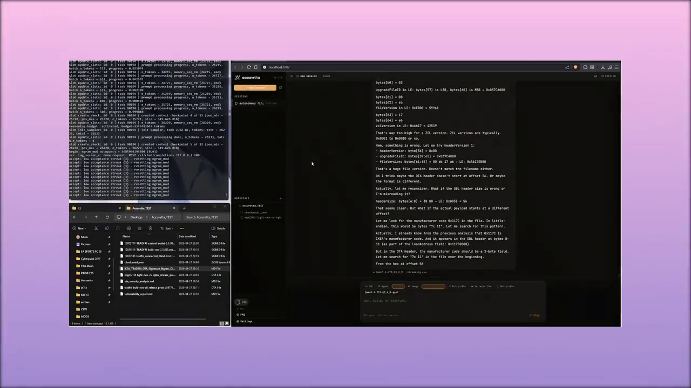
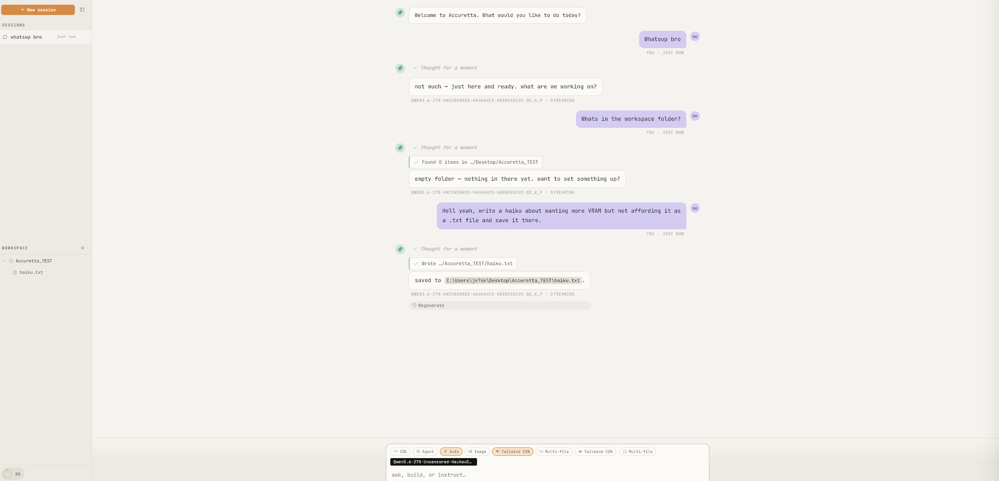
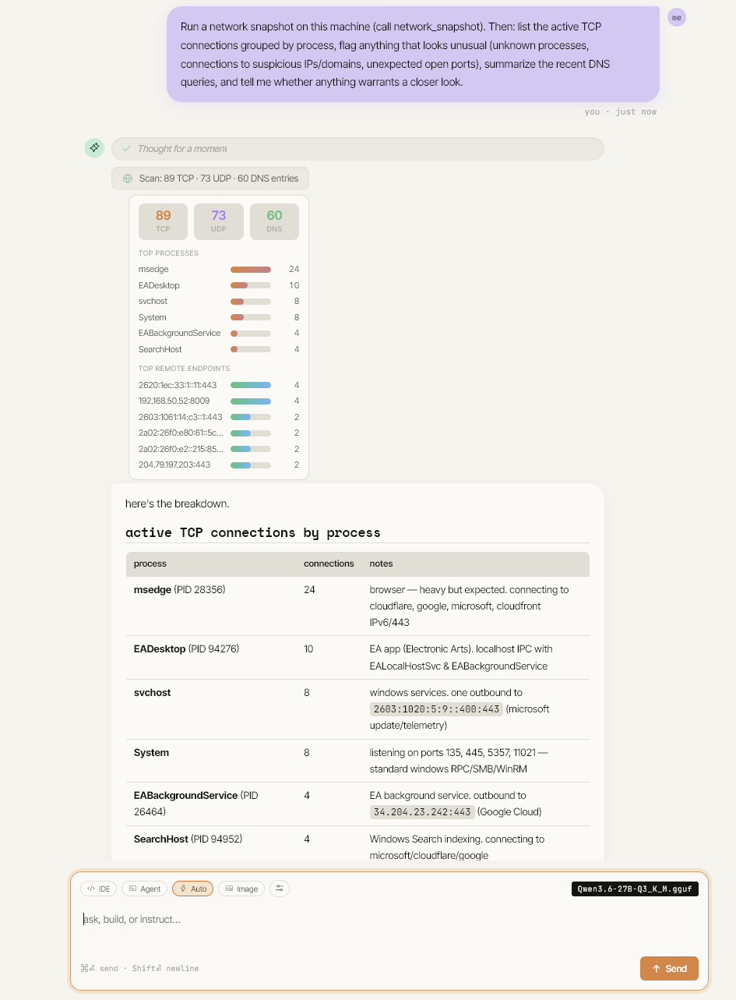
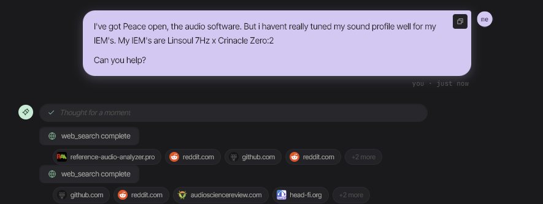
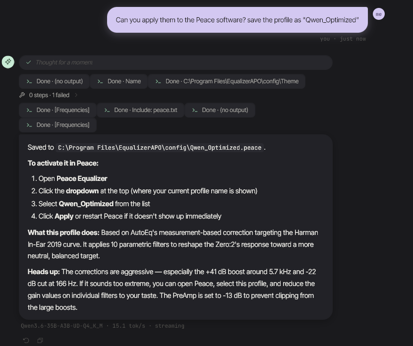
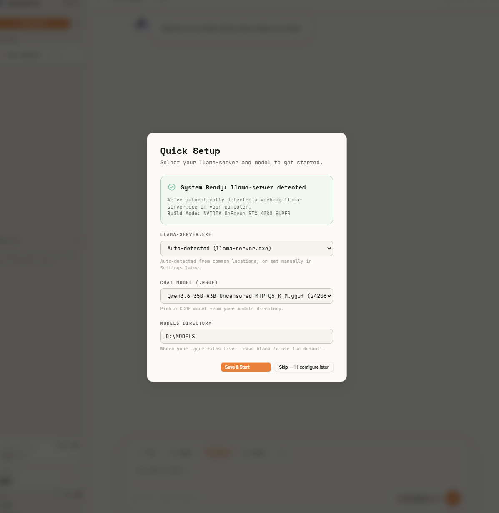

<div align="center">

<picture>
  <!-- GitHub honors prefers-color-scheme inside <picture><source> tags, so
       the README mark adapts to whichever theme the visitor's GitHub
       profile is set to: dark slab on light pages, white slab on dark. -->
  <source srcset="logo-mark-dark.png" media="(prefers-color-scheme: dark)">
  <source srcset="logo-mark-light.png" media="(prefers-color-scheme: light)">
  
</picture>

# Accuretta

**A fully local AI workspace. Your model, your files, your machine.**

[](LICENSE)
[](https://www.python.org/downloads/)
[](https://github.com/ggerganov/llama.cpp)
[](#privacy)
[](#privacy)
[](#quick-start)

<br />

<a href="https://github.com/user-attachments/assets/ff7ff8b8-56f9-4393-b4fa-1538a99b87f7" title="Click to play the demo video">
  
</a>

<sub>Click the image above to watch the demo (about 23 seconds, 1.9 MB).</sub>

</div>

<br />

## What it is

Accuretta is a small, friendly desktop AI workspace that runs entirely on your computer. You drop a GGUF model file in a folder, point it at the binary, and you get a chat UI with real tool use, a live HTML preview pane, a Python syntax checker, and a workspace tree that lets the model read and write files you choose. The bridge talks to llama.cpp through llama-server, so you get the speed and the knobs without having to wire up the whole stack yourself.

It is built on a few HTML files, one CSS file, one JS file, and one Python file. No build step, no npm, no electron wrapper. You can read every line in an afternoon.

## Why I made it

This started as a personal frustration. I had been paying for cloud AI subscriptions and watching the goalposts shift every few weeks. One service trimmed quotas. Another quietly swapped the model behind the same name. Then I tried Google Antigravity, decided I was tired of renting tools that could change under me, and started building something I actually owned.

The two rules from day one:

1. The model lives on my disk. Nothing leaves the computer unless I explicitly ask.
2. No subscriptions. The GPU is already paid for.

I came in fresh from Ollama and figured llama.cpp would be a sidegrade. It was not. Same hardware, same model file, noticeably faster generation, and clean control over things like KV cache quantization, flash attention, and speculative decoding. The tradeoff is that you wire it up yourself. Accuretta is partly that wiring, dressed up in a UI you can actually use.

## A look at the agent in action

The agent has hands. It can read files, write files, run commands, fetch web pages, take screenshots, and inspect network state. Anything destructive (file writes, shell commands) is gated by an approval card, so nothing dangerous happens silently. Read style actions like web fetches can run automatically depending on the model and your settings.

<p align="center">
  
</p>

<p align="center"><em>Above: the model picks up that the workspace is empty, decides to write a haiku to <code>haiku.txt</code>, and the file lands on disk. The session, the workspace, and the model are all visible in one place.</em></p>

A more interesting example. Below the model is asked to run a network snapshot, group active TCP connections by process, flag anything suspicious, and summarize recent DNS activity. It calls the snapshot tool, gets back a structured payload, then reasons about it in a real markdown table. No round trip to a cloud, no API key, no rate limit.

<p align="center">
  
</p>

One more, from a real session. I asked the agent to help tune my in-ear monitors (Linsoul 7Hz x Crinacle Zero:2) using Peace Equalizer APO. It searched audio review sites, Reddit threads, and AutoEQ measurement databases, picked a target curve (Harman In-Ear 2019), generated ten parametric filters with the right gain/Q/frequency for that specific IEM, and wrote a complete `.peace` profile straight into the EqualizerAPO config folder — including a PreAmp setting to prevent clipping and a heads-up that one of the boosts was unusually aggressive. No copy-pasting filters from a forum. No translating frequency tables into config syntax by hand. Ask, approve the writes, done.

<p align="center">
  
</p>

<p align="center"><em>Above: the agent searches reference-audio-analyzer.pro, audiosciencereview.com, head-fi.org, and Reddit for measurements and recommended targets for the specific IEMs.</em></p>

<p align="center">
  
</p>

<p align="center"><em>Above: ten parametric filters written to <code>C:\Program Files\EqualizerAPO\config\Qwen_Optimized.peace</code>, with clear activation steps and a frank note about the more aggressive corrections so I could dial them back if I wanted.</em></p>

## What you get

* **Chat with real tool use.** Read files, write files, run shell commands, fetch URLs, take screenshots, inspect processes and network state. Every destructive call goes through an approval card.
* **Live HTML preview.** When the model writes a webpage, you see it render next to the conversation. Switch between rendered view and source with one click.
* **Open existing HTML from your workspace.** Click the lightning bolt next to any `.html` file in the workspace tree and it loads into the preview pane with its real CSS, JS, and images intact. The bridge serves through a hardened endpoint with strict path traversal checks, so the iframe can only ever reach files inside the folder you opened.
* **Python syntax checker.** Click the checkmark next to any `.py` file and the bridge runs `compile()` on it. You get a green banner if it parses, or a red one with the line, column, and message. Nothing executes. No imports run. No risk.
* **Approval cards for everything destructive.** File writes and shell commands always prompt. Read style calls like web fetches can run automatically when you trust the model with that.
* **Conversation history on disk.** Sessions live in a folder you control. Branch them, rename them, delete them. Nothing is locked into a database.
* **A real settings drawer.** Context window, sampler temperature, top p, top k, KV cache type, GPU layers, batch size, thinking budget, model swap. All on the fly with a quick reload.
* **Mobile aware UI.** The whole thing works on a phone browser. Composer, sidebar, settings, swipe back to chat from the menu. No app store, no install, just open the localhost URL on the same network.
* **Tiny surface area.** A few static files and one Python script. Auditable in an afternoon.

## One-click auto-tune

Picking a model in Settings (with a VRAM tier set) automatically runs a tuner that reads the GGUF header for the model's actual architecture — layer count, attention config, MoE expert count, KV head dimensions — and computes the largest context window and the right CPU/GPU offload split for your card. No more hand-picking `--n-cpu-moe`, `--ctx-size`, or `--batch-size`. It picks them, applies them, reloads the model, you chat.

* **GGUF-direct math, not eyeballed.** KV cache cost per token comes from the model's actual `2 × n_layer × head_count_kv × head_dim × dtype_bytes`, not a size bucket. So a Q3 of a given architecture gets *more* context than a Q4 of the same architecture, because the smaller weights file leaves more VRAM free for KV cache.
* **MoE aware.** When the model is mixture-of-experts, the tuner figures out the dense vs expert split and offloads only as many expert layers to CPU as needed to fit, with a 70%-of-layers cap before it nudges you to grab a smaller quant instead. Speculative decoding is auto-disabled because it's net-negative on MoE per public benchmarks.
* **Grow only on context.** If autotune comes back with a smaller number than what you already had working, the larger value wins. Your saved ctx never shrinks behind your back.
* **Self-healing on boot.** Every time the app starts, autotune quietly re-runs in the background and updates flags if the algorithm has improved since you last saved. One toast tells you what changed.
* **Single click, single load.** Picking a model = "do the right thing for this model on my GPU." No separate Suggest step, no Save step, no manual reload.

> **\*Caveat — bigger context is not always better.** Some models will happily autoload very large contexts (200K+ tokens) when their GGUF reports it as supported. The math says it fits in VRAM, but attention itself slows down as the context window grows even before the conversation fills it. If you care more about tokens-per-second than maximum context, **lower the context window manually in Settings** for that specific use case. On a 16 GB card with a small MoE, **32K-65K is usually the sweet spot for sustained 30+ tok/s**. Bigger ctx = more headroom for long documents and conversations; smaller ctx = faster generation. Pick the one that matches what you are actually doing.

## APK static analysis

Drop an `.apk` into a workspace folder and the model can audit it directly through two tools the bridge ships with.

* **`scan_apk(path)`** — pure-Python triage. No external tools, no approval needed. Returns one structured report: package metadata, signing certs (subject/issuer/sha256, no key bytes), all requested permissions with the dangerous ones flagged, exported components, dex / native-lib / asset inventory, and a regex-driven secret hunt over DEX + `.so` files. The hunt covers AWS access keys, Google API keys, Firebase URLs, JWTs, GitHub PATs, Stripe keys, PEM private key blocks, hardcoded HTTP endpoints, IPv4 literals, and a generic `(api[_-]?key|secret|password|token)=…` assignment pattern. Findings are deduped and long literals are redacted in the middle so you see enough context to judge severity without echoing live tokens. A `risk_summary` field at the top surfaces the headlines (debuggable=true, allowBackup, cleartext traffic, dangerous permission count, exported component count, possible secret kinds) so the model can lead with what matters.
* **`decompile_apk(path, classes?)`** — shells out to [JADX](https://github.com/skylot/jadx). Writes Java sources + resources into a sandbox subdirectory next to the APK. Destructive (writes a folder), gated by an approval card. After it finishes, the model navigates the output with the existing `read_file` and `grep_files` tools. Pass `classes='com.target.foo.*'` to scope the decompile and finish faster on big APKs.

**Optional dependencies** (the tools degrade gracefully when these aren't installed):

```
pip install androguard            # full manifest / permissions / signing parse for scan_apk
# JADX 1.5+              -> https://github.com/skylot/jadx/releases (needs Java 11+)
```

If JADX isn't on `PATH`, set `jadx_path` in `data/settings.json` to the full path of `jadx.bat` (Windows) or `jadx` (Linux/macOS). Without androguard, `scan_apk` falls back to ZIP-only mode — file inventory and the secret hunt still run, but manifest/permissions are skipped and the report's `notes` field tells you what to install.

> **\*Real-world caveat.** Modern APKs ship R8-obfuscated. Decompiled output looks like `a.a.b.c` until you let JADX deobf-rename. Native libraries are increasingly where the interesting logic hides (auth, DRM) and static analysis only goes so far without dynamic instrumentation. `scan_apk` is the right first move every time — it gives the model a structured findings report to reason over instead of a raw ZIP. `decompile_apk` is for when you've narrowed down which class actually matters.

## Native binary analysis (Ghidra)

For the parts of an APK that JADX can't help with — the `.so` files in `lib/` — the bridge ships a `ghidra_analyze` tool that runs Ghidra in-process via [pyghidra](https://pypi.org/project/pyghidra/). Same idea as `scan_apk`: the model gets a structured JSON report (format, imports, exports, defined strings, function listing, dangerous-import flags) plus optional C-like decompilation of one named function. Works on any native binary, not just `.so` — also `.exe`, `.dll`, ELF, Mach-O, raw firmware.

* **`ghidra_analyze(path, function?, decompile?)`** — gated by approval, returns the report. With `function='SSL_verify'` and `decompile=true`, you get pseudocode for that one function. With no `function`, you get the metadata + risk summary so the model can pick where to dig.

**Setup:**

```
pip install pyghidra
# Ghidra (CLI bundle)  -> https://github.com/NationalSecurityAgency/ghidra/releases
# JDK 21+ (Temurin)    -> https://adoptium.net
```

Then point the bridge at your Ghidra install root in `data/settings.json`:

```json
"ghidra_path": "C:\\Program Files\\ghidra_12.0.4_PUBLIC"
```

(Or set `$GHIDRA_INSTALL_DIR`. Auto-detects common Windows install patterns if neither is set.)

**Performance.** First call boots the JVM (~10s) and then runs Ghidra auto-analysis (~30s on a typical `.so`). The JVM stays loaded for the lifetime of the bridge process, so calls 2..N reuse it — analysis on a small file usually finishes in under 5 seconds. Memory cost: ~600 MB resident once started, regardless of how many binaries you've analyzed. If you don't plan to use it, leave `pyghidra` uninstalled and the import is a no-op.

> **\*Why Ghidra.** Ghidra has the best free decompiler (the one that ships with IDA Pro costs a four-figure license) and Python automation through pyghidra means we don't need a custom Ghidra script per query. The risk surface (`strcpy`, `system`, `dlopen`, `mprotect`, `ptrace`, etc.) is flagged automatically, so the model can lead with "this binary loads code at runtime" or "this binary disables write-protection on memory pages" without having to enumerate imports manually.

## Fast triage (binary_inspect) and pattern matching (yara_scan)

Ghidra is the right tool for "show me the pseudocode of this function" — it's the wrong tool for "is this exe worth looking at." Two lighter tools cover that gap and run in milliseconds instead of half a minute, so the model can use them as a default starting point and only escalate when the triage looks interesting.

* **`binary_inspect(path)`** — pure-Python PE/ELF/Mach-O triage via [pefile](https://pypi.org/project/pefile/) and [pyelftools](https://pypi.org/project/pyelftools/). Returns format, architecture, sections (with R/W/X flags and per-section Shannon entropy), the full import table grouped by DLL, exports, Authenticode signature presence, imphash, and packer hints (`.upx`, `.vmp`, `.themida`, `.aspack`, etc.) — plus a `risk_summary` that combines dangerous imports + high-entropy sections + unsigned-PE into a single short list. Approval-free, ~50 ms on a typical exe. The model uses this to decide whether `ghidra_analyze` is worth ~30 s.

* **`yara_scan(path, rules?, recursive?)`** — pattern matching over a file or directory using [yara-python](https://pypi.org/project/yara-python/). Ships with a small bundled rule set covering common malware tells (autorun registry keys, process-injection API combos, `mimikatz` strings, base64-encoded MZ headers, encoded PowerShell, suspicious paste/discord/ngrok URLs). Pass `rules='C:\\path\\to\\my.yar'` to point at a custom rule file, or pass an inline rule source string for ad-hoc queries. Approval-free, single-file scans land in tens of milliseconds.

**Setup:**

```
pip install pefile pyelftools yara-python
```

All three are pure-Python wheels with prebuilt binaries on PyPI — no compiler dance, no JDK, no extra config. If any of them is missing the tool returns a friendly "install with: pip install …" message instead of crashing the bridge.

## Agentic Coding Tools

To drastically reduce the token-overhead of working with large projects, the bridge exposes three native, standard-library-only tools for the model to use when reasoning about code:

*   **`read_skeleton(path)`** — extracts the structural skeleton (classes, functions, signatures, docstrings) of a Python or JS/TS file without reading the entire file. This allows the model to scan a 5,000-line file using only a few hundred tokens of context.
*   **`check_syntax(path)`** — runs `ast.parse` (or `node --check`) on a target file to verify its syntax. The model uses this automatically to verify its own edits are correct before returning control to you.
*   **`run_tests(command, cwd)`** — a subprocess wrapper that runs test suites (like `pytest` or `npm test`) and intelligently filters the noise from `stdout`, returning just the failure hints, tracebacks, and pass/fail booleans to the agent.

## Universal MCP Support (Model Context Protocol)

Accuretta natively supports any external MCP Server via a lightweight, dependency-free stdio client built directly into `bridge.py`.

You can plug in official servers (like GitHub, SQLite, Google Drive, PostgreSQL) and their capabilities are dynamically mapped into native tools for the agent to use.

**Zero-Friction Setup:**
Simply drop a `bridge_mcp_config.json` next to `bridge.py` using the exact same standard configuration schema used by Claude Desktop:

```json
{
  "mcpServers": {
    "github": {
      "command": "npx.cmd",
      "args": ["-y", "@modelcontextprotocol/server-github"],
      "env": { "GITHUB_PERSONAL_ACCESS_TOKEN": "ghp_abc123..." }
    }
  }
}
```

Restart `bridge.py`, and the new tools instantly appear in the agent's toolbelt.

> **\*Safety First:** Because MCP servers can run arbitrary commands depending on their implementation, **every single MCP tool call is strictly Approval-Gated by default**. The bridge will prompt you with an approval card showing the tool name and exact JSON payload before allowing the server to execute anything.

## Who this is for

* People who want a Cursor or Antigravity style experience without the subscription
* People who already have a decent GPU and would rather use it than rent one through an API
* Tinkerers who want to swap models around (Qwen, GLM, Llama, Gemma, anything llama.cpp supports) and see what works best for their box
* Privacy people who do not want their drafts, their code, or their thinking sent to a server somewhere
* Anyone who got tired of watching big AI companies decide what their tool is allowed to do this week

## What it is not

* Not a polished commercial product. There are rough edges and the docs are mostly this README.
* Not going to beat Claude Sonnet or GPT 5 on a 24B model running on a laptop. Local is local. Pick the right tool for the job.
* Not a llama.cpp replacement. It is a friendly front end that sits on top of llama-server.
* Not trying to be a code editor. It is a chat workspace that happens to render code, preview HTML, and check Python syntax.

## Privacy

Nothing about you, your prompts, or your files leaves your computer. The bridge talks to two things on localhost: your llama-server instance and your browser. That is it. There is no telemetry, no analytics, no anonymous account, no cloud sync, no opt out screen because there is nothing to opt out of.

The one outbound channel is the agent's own web fetch tool. When the model asks to read a URL, that request goes out from your machine to that site, the same way your browser would. Some models will ask first via an approval card, others will just do it as part of answering your question. Either way nothing is sent unless the model decided it needed something off the open web for the task you gave it.

If you are paranoid (and you should be), run Wireshark next to it. The only outbound traffic you will see is whatever the agent fetched. Want full silence? Run with the network unplugged or block the bridge process at the firewall. The model itself runs offline once loaded, so you can chat all day with no internet at all.

## Before you start

A few things that will save you a long debugging session:

* **Python 3.10 or newer.** 3.14 works too. earlier versions might run but are not tested.
* **A llama-server binary that actually loads your model.** download a release from [ggml-org/llama.cpp/releases](https://github.com/ggml-org/llama.cpp/releases). NVIDIA users grab the CUDA build (e.g. `llama-bNNNN-bin-win-cuda-13-x64.zip`) AND the matching CUDA DLLs zip (e.g. `cudart-llama-bin-win-cuda-13.1-x64.zip`). extract both into the same folder. without the DLLs llama-server crashes on launch with no useful error.
* **Match the CUDA build to your driver.** run `nvidia-smi` and look at the CUDA Version field top right. CUDA 13 build needs a 13.x driver, CUDA 12 build runs on 12.x or newer drivers.
* **At least one GGUF model on disk.** anything llama.cpp can load. avoid the brand-new MTP / hybrid variants (e.g. some Qwen3.6 MTP GGUFs from Unsloth) unless your llama.cpp build is recent enough to load SSM tensors. if you see `error loading model: missing tensor 'blk.NN.ssm_conv1d.weight'` your binary is too old for that model. grab the non-MTP version of the same model and you're fine.
* **Pick a speculative-decoding strategy that matches your llama.cpp build.** the `spec_strategy` setting (Settings → Speculative decoding, or `data/settings.json`) takes three values: `"ngram-mod"` (default, works on any model and any reasonably modern build), `"draft-mtp"` (uses the model's built-in MTP heads — Qwen 3.5/3.6, DeepSeek V3/R1 — and needs a llama.cpp build from **2026-05-16** or later, PR #22673), and `"off"` (no speculative decoding at all). picking `draft-mtp` on a model without MTP heads, or on an older binary, makes llama-server exit on startup — set it to `"off"` and reload if that happens. older settings files with `"enable_speculative": false` still work; the bridge migrates the value lazily.

## Quick start

Accuretta now comes with a polished setup wizard that scans your hardware, downloads the recommended llama.cpp binaries automatically, and autotunes your selected models for optimal performance.

<p align="center">
  
</p>

1. Install Python 3.10 or newer.
2. Install dependencies: `pip install -r requirements.txt`
3. Have at least one GGUF model file in a folder on your computer.
4. Double click `start.bat` (Windows) or run `python bridge.py` in your terminal.
5. Open the printed URL in your browser (default is `http://localhost:8787`).
6. The setup wizard will automatically open to guide you through:
   * **System Hardware Scan**: Accuretta detects your GPU and hardware capabilities.
   * **1-Click Binary Downloader**: Links or downloads the official llama.cpp binary built specifically for your hardware (CUDA for NVIDIA, Vulkan for AMD/Intel, or LLVM CPU).
   * **Model Selection & Auto-Tune**: Select your model and Accuretta automatically suggests and applies optimal parameters (such as optimal context size, GPU offload layers, and cache quantization) before spawning the backend.

The first session creates a `data/` folder next to `bridge.py` that holds your chats, settings, workspace pointers, and memories. Back it up if you care about it. Delete it if you want a clean slate.

## Remote access over Tailscale

The bridge listens on your LAN by default, so any device on the same network can already reach it at `http://<your-machine-name>:8787`. Pair that with [Tailscale](https://tailscale.com) and you have your own private AI server reachable from anywhere — laptop in a coffee shop, phone on cellular, friend's couch. Same UI, same model, same conversation history. Nothing leaves your tailnet.

No cloud relay, no port forwarding, no exposing your machine to the open internet. Install Tailscale on the machine running Accuretta and on whatever device you want to chat from, and the URL `http://<machine-name>:8787` (or the tailnet IP) just works. The mobile UI is built for this exact use case — phone browser, no app store, no install. Open the URL and you are in.

A nice side effect: your conversations and your model never round-trip through someone else's data center. The privacy story holds even when you are not at home.

## Remote control over Discord

Tailscale gives you the full web UI from anywhere. Discord gives you something different: a chat thread you can fire off from your phone's lock screen, with real push notifications, while Accuretta does the work on your PC. Handy when the mobile browser has suspended the web app, or when you just want to kick off a task and get pinged when it finishes.

Accuretta runs as a Discord bot that connects outbound to Discord. No port forwarding, no inbound hole in your firewall, your machine stays closed. It obeys exactly one Discord user id (yours), and every write, command, or file change still needs approval. You approve straight from the chat by reacting, so the safety gate works from your pocket.

Setup, once:

1. `pip install discord.py`
2. Create an application at https://discord.com/developers/applications, open the Bot tab, copy the token, and turn on the Message Content Intent.
3. Invite the bot to any server you are in (OAuth2, URL Generator, `bot` scope) so Discord lets you open a DM with it.
4. In Discord, enable Developer Mode, then right click your own name and Copy User ID.
5. In Accuretta Settings, under Discord remote bridge, paste the token and your user id, toggle it on, and restart the bridge.

Now DM the bot and ask it to do anything you would ask in the web UI. When a tool needs approval it posts the command with a check and a cross, and your tap runs or denies it. Friends you let into the server can chat with it too, but only you can make it touch the machine, and if no model is loaded it simply says it is offline.

## Repository layout

```
accuretta/
  bridge.py              the Python bridge (model launcher, tool runtime, HTTP server)
  index.html             the UI shell
  app.js                 all UI logic
  app.css                main stylesheet
  colors_and_type.css    theme tokens
  logo-mark.png          the orbital A logo
  start.bat              minimal Windows launcher
  requirements.txt       Python dependencies
  data/                  runtime state, created on first run
  media/                 readme assets (screenshots, demo video)
```

## Status

Personal project. I work on it when I feel like it. Pull requests are welcome but I am not building a roadmap or chasing stars. If you fork it and make it your own, that is the entire point.

## License

MIT. See [LICENSE](LICENSE). Free for personal use. Use it, change it, ship it. The only thing I ask is that you do not pretend you wrote the parts you did not.
