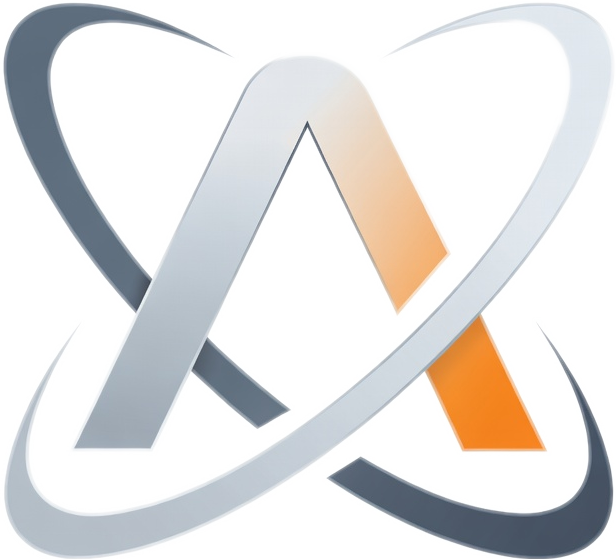

<div align="center">



# Accuretta

**A fully local AI workspace. Your model, your files, your machine.**

[](LICENSE)
[](https://www.python.org/downloads/)
[](https://github.com/ggerganov/llama.cpp)
[](#privacy)
[](#privacy)
[](#quick-start)

<br />

<video src="https://raw.githubusercontent.com/mkultraware/accuretta/main/media/demo.mp4" controls muted width="780"></video>

<sub>If your viewer does not play the video inline, click <a href="media/demo.mp4"><code>media/demo.mp4</code></a> to watch it directly on GitHub.</sub>

</div>

<br />

## What it is

Accuretta is a small, friendly desktop AI workspace that runs entirely on your computer. You drop a GGUF model file in a folder, point it at the binary, and you get a chat UI with real tool use, a live HTML preview pane, a Python syntax checker, and a workspace tree that lets the model read and write files you choose. The bridge talks to llama.cpp through llama-server, so you get the speed and the knobs without having to wire up the whole stack yourself.

It is built on a few HTML files, one CSS file, one JS file, and one Python file. No build step, no npm, no electron wrapper. You can read every line in an afternoon.

## Why I made it

This started as a personal frustration. I had been paying for cloud AI subscriptions and watching the goalposts shift every few weeks. One service trimmed quotas. Another quietly swapped the model behind the same name. Then I tried Google Antigravity, decided I was tired of renting tools that could change under me, and started building something I actually owned.

The two rules from day one:

1. The model lives on my disk. Nothing leaves the computer unless I explicitly ask.
2. No subscriptions. The GPU is already paid for.

I came in fresh from Ollama and figured llama.cpp would be a sidegrade. It was not. Same hardware, same model file, noticeably faster generation, and clean control over things like KV cache quantization, flash attention, and speculative decoding. The tradeoff is that you wire it up yourself. Accuretta is partly that wiring, dressed up in a UI you can actually use.

## A look at the agent in action

The agent has hands. It can read files, write files, run commands, fetch web pages, take screenshots, and inspect network state. Every action that touches your disk or your network is gated by an approval card, so nothing happens silently.

<p align="center">
  
</p>

<p align="center"><em>Above: the model picks up that the workspace is empty, decides to write a haiku to <code>haiku.txt</code>, and the file lands on disk. The session, the workspace, and the model are all visible in one place.</em></p>

A more interesting example. Below the model is asked to run a network snapshot, group active TCP connections by process, flag anything suspicious, and summarize recent DNS activity. It calls the snapshot tool, gets back a structured payload, then reasons about it in a real markdown table. No round trip to a cloud, no API key, no rate limit.

<p align="center">
  
</p>

## What you get

* **Chat with real tool use.** Read files, write files, run shell commands, fetch URLs, take screenshots, inspect processes and network state. Every destructive call goes through an approval card.
* **Live HTML preview.** When the model writes a webpage, you see it render next to the conversation. Switch between rendered view and source with one click.
* **Open existing HTML from your workspace.** Click the lightning bolt next to any `.html` file in the workspace tree and it loads into the preview pane with its real CSS, JS, and images intact. The bridge serves through a hardened endpoint with strict path traversal checks, so the iframe can only ever reach files inside the folder you opened.
* **Python syntax checker.** Click the checkmark next to any `.py` file and the bridge runs `compile()` on it. You get a green banner if it parses, or a red one with the line, column, and message. Nothing executes. No imports run. No risk.
* **Approval cards for everything risky.** File writes, shell commands, web fetches. The agent never silently does the dangerous thing.
* **Conversation history on disk.** Sessions live in a folder you control. Branch them, rename them, delete them. Nothing is locked into a database.
* **A real settings drawer.** Context window, sampler temperature, top p, top k, KV cache type, GPU layers, batch size, thinking budget, model swap. All on the fly with a quick reload.
* **Mobile aware UI.** The whole thing works on a phone browser. Composer, sidebar, settings, swipe back to chat from the menu. No app store, no install, just open the localhost URL on the same network.
* **Tiny surface area.** A few static files and one Python script. Auditable in an afternoon.

## Who this is for

* People who want a Cursor or Antigravity style experience without the subscription
* People who already have a decent GPU and would rather use it than rent one through an API
* Tinkerers who want to swap models around (Qwen, GLM, Llama, Gemma, anything llama.cpp supports) and see what works best for their box
* Privacy people who do not want their drafts, their code, or their thinking sent to a server somewhere
* Anyone who got tired of watching big AI companies decide what their tool is allowed to do this week

## What it is not

* Not a polished commercial product. There are rough edges and the docs are mostly this README.
* Not going to beat Claude Sonnet or GPT 5 on a 24B model running on a laptop. Local is local. Pick the right tool for the job.
* Not a llama.cpp replacement. It is a friendly front end that sits on top of llama-server.
* Not trying to be a code editor. It is a chat workspace that happens to render code, preview HTML, and check Python syntax.

## Privacy

Nothing leaves your computer unless you ask. The bridge talks to two things on localhost: your llama-server instance and your browser. That is it. Web fetches go through an approval card before any request fires. There is no telemetry, no analytics, no anonymous account, no cloud sync, no opt out screen because there is nothing to opt out of.

If you are paranoid (and you should be), you can run Wireshark next to it. The only outbound traffic you will see is whatever you explicitly approved.

## Quick start

1. Install Python 3.10 or newer.
2. Install dependencies: `pip install -r requirements.txt`
3. Have `llama-server` (or `llama-server.exe` on Windows) somewhere on disk. Use the CUDA build for NVIDIA, the Vulkan build for everything else, or the CPU build if you are brave.
4. Have at least one GGUF model file on disk. Anything llama.cpp can load. A 23B Q4 in the GLM 4.7 family or a Qwen 3 series instruct in the 7B to 32B range is a good starting point on consumer hardware.
5. Double click `start.bat` (Windows) or run `python bridge.py` from the repo root.
6. Open the printed URL in your browser. The default is `http://localhost:8787`.
7. Open Settings, point it at your models folder and llama-server binary, pick a model, and chat.

The first session creates a `data/` folder next to `bridge.py` that holds your chats, settings, workspace pointers, and memories. Back it up if you care about it. Delete it if you want a clean slate.

## Repository layout

```
accuretta/
  bridge.py              the Python bridge (model launcher, tool runtime, HTTP server)
  index.html             the UI shell
  app.js                 all UI logic
  app.css                main stylesheet
  colors_and_type.css    theme tokens
  logo-mark.png          the orbital A logo
  start.bat              minimal Windows launcher
  requirements.txt       Python dependencies
  data/                  runtime state, created on first run
  media/                 readme assets (screenshots, demo video)
```

## Status

Personal project. I work on it when I feel like it. Pull requests are welcome but I am not building a roadmap or chasing stars. If you fork it and make it your own, that is the entire point.

## License

MIT. See [LICENSE](LICENSE). Use it, change it, ship it, sell it. The only thing I ask is that you do not pretend you wrote the parts you did not.
